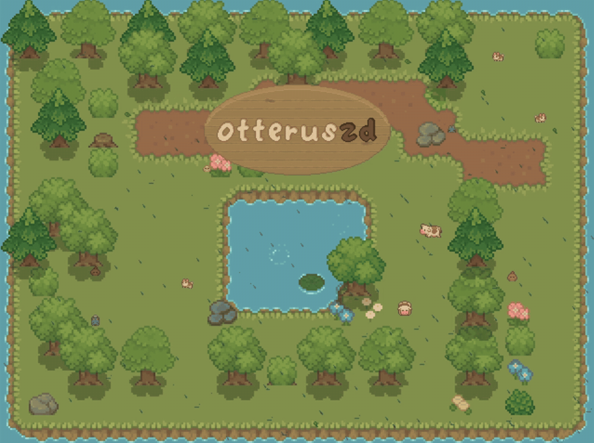
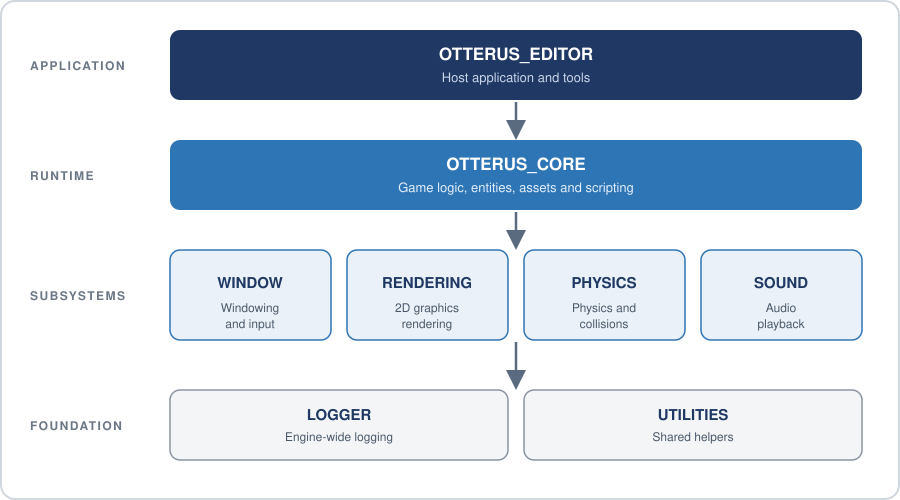

# 🦦 Otterus2D

A modular 2D game engine built from scratch in **C++20** and **OpenGL 4.5**, with an EnTT-based ECS, Box2D physics and Lua scripting.

<p align="center"></p>

<p align="center"><em>A cozy scene running on the engine: tilemap, animated sprites, particles and audio, all driven by Lua scripts.</em></p>

---

## Highlights

- **Batched renderer** for sprites, text and shapes on a modern OpenGL 4.5 Core pipeline
- **Data-oriented ECS** on EnTT, split into focused systems
- **Lua scripting** (Lua 5.3 + Sol3) with the engine API exposed to scripts
- **Box2D physics** with collision callbacks bridged to ECS entities
- **Editor shell** built on Dear ImGui (docking, scene viewport, log console)

---

## Features

| Area | What's included |
| :--- | :--- |
| **Rendering** | Dynamic batching, layer-sorted sprites, primitives (rect, circle, line), TrueType text, 2D camera, framebuffers |
| **ECS** | EnTT registry with transform, sprite, animation, collider, physics, text and script components |
| **Scripting** | Lua access to entities, input, assets, timers, random and a game state stack, plus a follow camera |
| **Physics** | Static, kinematic and dynamic bodies, sensors and triggers, runtime collider debug view |
| **Audio** | Streamed music (MP3) and multi-channel sound effects (WAV) via SDL2_mixer |
| **Assets** | Cached textures, shaders, fonts and audio through a central `AssetManager` |
| **Tooling** | ImGui editor shell, scene viewport, filterable log console, structured logger with source locations |

<details>
<summary><b>Component and system details</b></summary>

**Components:** `TransformComponent`, `SpriteComponent`, `AnimationComponent`, `BoxColliderComponent`, `CircleColliderComponent`, `RigidBodyComponent`, `PhysicsComponent`, `TextComponent`, `Identification`, `ScriptComponent`

**Systems:** `RenderSystem`, `RenderShapeSystem`, `RenderUISystem`, `AnimationSystem`, `PhysicsSystem`, `ScriptingSystem`

</details>

---

## Quick Start

**Requirements**

- Windows 10/11 (64-bit)
- Visual Studio 2022 (MSVC v143+) with C++20
- CMake 3.20+
- GPU with OpenGL 4.5 support

> **Dependencies:** prebuilt third-party libraries are not committed to the repo. Download [`dependencies-win-x64.zip`](https://github.com/Umair-Manzoor-47/Otterus2D/releases/tag/deps-win-x64-v1) from the releases page and extract it into the repo root, so that `Dependencies/` sits next to `CMakeLists.txt`. The bundle contains x64 MSVC builds with static runtime linkage (`/MT` Release, `/MTd` Debug).

**Build**

```powershell
git clone https://github.com/Umair-Manzoor-47/Otterus2D.git
cd Otterus2D

# Download and extract the prebuilt dependencies into ./Dependencies
Invoke-WebRequest -Uri "https://github.com/Umair-Manzoor-47/Otterus2D/releases/download/deps-win-x64-v1/dependencies-win-x64.zip" -OutFile deps.zip
Expand-Archive deps.zip -DestinationPath .
Remove-Item deps.zip

cmake -B build -S . -DCMAKE_BUILD_TYPE=Release
cmake --build build --config Release
```

**Run**

A post-build step copies the runtime DLLs and `assets/` next to the executable.

```powershell
cd build/bin
.\OTTERUS_EDITOR.exe
```

With a multi-config Visual Studio generator the executable is in `build/bin/Release`.

---

## Architecture

The engine is a stack of static libraries. Each layer depends only on the layers below it.
<p align="center"> Core -> subsystems -> Logger and Utilities" width="720"></p>


| Module | Responsibility |
| :--- | :--- |
| `OTTERUS_CORE` | ECS components and systems, asset caching, state stack, Lua bindings |
| `OTTERUS_RENDERING` | Batch renderers, shaders, textures, font atlases, cameras, framebuffers |
| `OTTERUS_PHYSICS` | Box2D wrappers, contact listener, collision user data |
| `OTTERUS_SOUND` | `MusicPlayer` and `SoundFxPlayer` over SDL2_mixer |
| `OTTERUS_WINDOW` | SDL2 window, OpenGL context, keyboard and mouse input |
| `OTTERUS_LOGGER` | Structured logging with timestamps and `std::source_location` |
| `OTTERUS_UTILITIES` | Frame timer, random generator, SDL RAII deleters |
| `OTTERUS_EDITOR` | Entry point, main loop, ImGui docking workspace, scene view, log console |

---

## Design Decisions

| Decision | Approach |
| :--- | :--- |
| **ECS over inheritance** | Components are plain data in EnTT pools, so systems iterate linearly and stay cache-friendly. |
| **Batched rendering** | A templated `Batcher` buffers geometry into dynamic vertex arrays. Sprites are sorted by layer and grouped by texture to cut draw calls. |
| **Lua at the edge** | Gameplay lives in scripts via Sol3. Box2D contacts reach Lua through `std::any` and EnTT meta in `UserData`, with no hard-coded class dependencies. |
| **Central asset cache** | `AssetManager` loads each resource once and shares it as a `shared_ptr` between C++ and Lua. |
| **RAII for C resources** | SDL and Box2D handles are wrapped in smart pointers with custom deleters, so cleanup happens at scope exit. |

---

## Tech Stack

| Library | Version | Used for |
| :--- | :--- | :--- |
| SDL2 / SDL2_mixer | 2.26.5 / 2.6.3 | Window, input, audio |
| EnTT | 3.12.2 | ECS |
| Box2D | 2.4.x | Physics |
| Lua + Sol3 | 5.3.5 / 3.2.3 | Scripting |
| GLM | 1.0.3 | Math |
| Dear ImGui | 1.93 WIP | Editor UI |
| GLAD, SOIL / stb | n/a | OpenGL loading, images, font baking |

---

## Roadmap

**Status:** active development

- [ ] UI system (layout containers, buttons, sliders, input fields)
- [ ] Editor panels: scene hierarchy, component inspector, asset browser
- [ ] Decouple editor from engine
- [ ] Linux build support
- [ ] Automated tests and CI

---

## Links

- **Author:** Umair Manzoor
<!-- ... - **Devlog:** `[TODO: YouTube link]` ...-->
- **LinkedIn:** [Umair Manzoor](https://www.linkedin.com/in/umair-manzoor/)
- **Issues:** [github.com/Umair-Manzoor-47/Otterus2D/issues](https://github.com/Umair-Manzoor-47/Otterus2D/issues)
- **License:** [MIT](LICENSE)